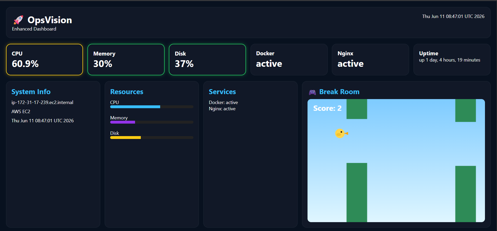
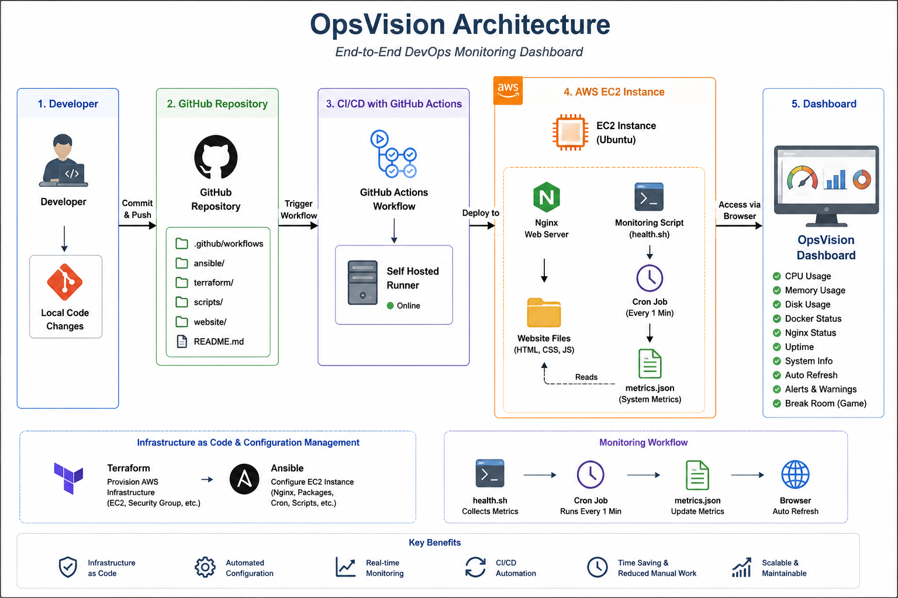

# 🚀 OpsVision - DevOps Monitoring Dashboard

## Dashboard Preview



## Architecture



## 📖 Overview

OpsVision is an end-to-end DevOps project designed to demonstrate modern Infrastructure as Code (IaC), Configuration Management, Monitoring, Automation, and CI/CD practices.

The project provisions cloud infrastructure, configures servers automatically, collects system health metrics, generates monitoring data, displays them on a live dashboard, and deploys updates automatically using GitHub Actions and a self-hosted runner.

The primary goal of this project was to gain hands-on experience with real-world DevOps tools and build a production-style monitoring platform from scratch.

---

# 🏗️ Architecture

```text
Developer
    │
    ▼
GitHub Repository
    │
    ▼
GitHub Actions
(Self Hosted Runner)
    │
    ▼
AWS EC2 Instance
    │
 ┌──┴─────────────┐
 │                │
 ▼                ▼
Nginx         Monitoring Script
 │                │
 ▼                ▼
Dashboard     metrics.json
```

---

# 🛠️ Technologies Used

## Cloud

* AWS EC2

## Infrastructure as Code

* Terraform

## Configuration Management

* Ansible

## Web Server

* Nginx

## Scripting

* Bash Shell Scripting

## Monitoring

* Cron Jobs
* JSON Metrics Generation

## Frontend

* HTML
* CSS
* JavaScript

## CI/CD

* GitHub Actions
* Self Hosted Runner

---

# 🎯 Project Objectives

The project was built to achieve the following objectives:

* Provision infrastructure using Terraform
* Configure servers using Ansible
* Automate monitoring data collection
* Create a live monitoring dashboard
* Implement auto-refresh functionality
* Add threshold-based visual alerts
* Automate deployments using GitHub Actions
* Gain hands-on experience with DevOps workflows

---

# ⚙️ Infrastructure Provisioning

Terraform was used to provision the cloud infrastructure.

Resources provisioned:

* EC2 Instance
* Security Groups
* Required networking configuration

Benefits:

* Repeatable deployments
* Version-controlled infrastructure
* Easy environment recreation

---

# 🔧 Configuration Management

Ansible was used to automate server configuration.

Tasks automated:

* Package installation
* Nginx installation
* Service configuration
* Application deployment preparation

Benefits:

* Eliminates manual configuration
* Ensures consistency
* Reduces deployment errors

---

# 📊 Monitoring System

A custom shell script was created to collect system metrics.

Metrics collected:

* CPU Usage
* Memory Usage
* Disk Usage
* Docker Status
* Nginx Status
* System Uptime
* Host Information
* Current Server Time

The script generates a JSON file consumed by the dashboard.

Example:

```json
{
  "cpu": "18%",
  "memory": "24%",
  "disk": "25%",
  "docker": "active",
  "nginx": "active"
}
```

Benefits:

* Lightweight
* No external monitoring tools required
* Real-time server visibility

---

# ⏰ Automation Using Cron

Cron was configured to execute the monitoring script automatically at scheduled intervals.

Workflow:

```text
Cron
   │
   ▼
health.sh
   │
   ▼
metrics.json
   │
   ▼
Dashboard Update
```

Benefits:

* Automated metric collection
* No manual intervention
* Continuous monitoring

---

# 🖥️ Dashboard

A custom dashboard was developed using HTML, CSS, and JavaScript.

Features:

* Real-time metrics display
* Modern UI design
* Resource utilization bars
* Service status monitoring
* Auto-refresh capability
* Alert highlighting based on thresholds
* Interactive Break Room game

Displayed Information:

* CPU Usage
* Memory Usage
* Disk Usage
* Docker Status
* Nginx Status
* System Uptime
* Hostname
* Current Time

---

# 🔄 Auto Refresh

JavaScript periodically fetches the latest metrics without requiring a page refresh.

Workflow:

```text
Browser
   │
   ▼
Fetch metrics.json
   │
   ▼
Update Dashboard
```

Benefits:

* Near real-time monitoring
* Improved user experience
* Reduced manual effort

---

# 🚨 Alert System

Visual alert indicators were implemented to highlight resource utilization.

Thresholds:

| Resource Usage | Status   |
| -------------- | -------- |
| Below 60%      | Normal   |
| 60% - 79%      | Warning  |
| 80% and above  | Critical |

Benefits:

* Quick issue identification
* Improved operational visibility

---

# 🎮 Break Room

A lightweight browser game was added to the dashboard.

Purpose:

* Demonstrate frontend integration
* Provide an interactive element within the application
* Enhance user engagement

---

# 🚀 CI/CD Pipeline

GitHub Actions with a self-hosted runner were implemented to automate deployments.

Workflow:

```text
Code Change
    │
    ▼
Git Commit
    │
    ▼
Git Push
    │
    ▼
GitHub Actions
    │
    ▼
Self Hosted Runner
    │
    ▼
Deploy Updated Files
    │
    ▼
Nginx Serves Latest Version
```

Benefits:

* Automated deployments
* Faster delivery
* Reduced manual effort
* Consistent deployments

---

# 📂 Project Structure

```text
OpsVision/
│
├── .github/
│   └── workflows/
│
├── terraform/
│
├── ansible/
│
├── scripts/
│
├── website/
│   ├── data/
│   ├── index.html
│   ├── style.css
│   └── app.js
│
└── README.md
```

---

# 📈 Key Learnings

Through this project I gained practical experience with:

* Infrastructure as Code
* Configuration Management
* Linux Administration
* Shell Scripting
* Monitoring Concepts
* Web Server Configuration
* AWS Services
* GitHub Actions
* Self Hosted Runners
* CI/CD Pipelines
* Troubleshooting and Debugging

---

# 🔮 Future Enhancements

Potential future improvements include:

* Alert History Tracking
* Email Notifications
* Slack Integration
* Docker Containerization
* HTTPS with SSL Certificates
* Custom Domain
* Multi-Server Monitoring
* Historical Metrics Visualization

---

# ✅ Project Outcome

OpsVision successfully demonstrates an end-to-end DevOps workflow by combining infrastructure provisioning, automated configuration, monitoring, dashboard visualization, automation, and CI/CD deployment into a single integrated platform.

The project serves as a practical implementation of core DevOps principles and showcases hands-on experience with industry-standard tools and practices.
